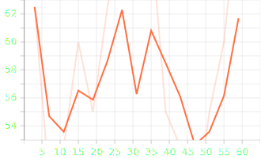

<h1>Performance of Models</h1>

| Model                                                              | Training Time (sec) | Training Loss | Training Accuracy | Testing Accuracy | Number of Parameters |
|--------------------------------------------------------------------|---------------|---------------|-------------------|------------------|----------------------|
| VGG (1 block)                                                      | 136.79       | 47.5             | 52.5%                | 50%               |81921409            |
| VGG (3 blocks)                                                     | 134.02       | 8.42             | 100%                | 75%               | 20573761            |
| VGG (3 blocks) with data augmentation                             | 137.53       | 0.029             | 98.75%                | 67.5%               | 20573761|
| Transfer learning using VGG16 with tuning all layers              | 30.9435       | 0.7385             | 43.125%                | 50.0%               | 134264641            |
| Transfer learning using VGG16 with tuning only final MLP layers    | 27.626       | 0.1296             | 99.375%                | 97.5%               |119549953 (Trainable)            |
| MLP model                                                          | 134.94      | 0.637             | 51.875%                | 55%               | 248557569           |

<h1>Vgg1</h1>
Image Data

Accuracy_test

Accuracy_train

Training Loss

<h1>VGG3</h1>

Accuracy_test

Accuracy_train

Training Loss

<h1>Vgg3 augmented</h1>

Accuracy_test

Accuracy_train

Training Loss

<h1>Vgg16(all)</h1>

<!--  -->
Accuracy_test

Accuracy_train

Training Loss

<h1>Vgg16(all)</h1>

<!--  -->
Accuracy_test

Accuracy_train

Training Loss

<h2>Questions</h2>

- **Are the results as expected? Why or why not?** 
Vgg3 performend bettter than vgg1 and similiarly vgg16 also performned better  than vgg3. The augmenetd dataset model didnt perform as expected. even though augmentation gives us diverse inputs to train on the test dataset evaluation results doesnt hold up to this expectation. This may be due to the smaller datset size used. The VGG16 models behaved as expected. The MLP model performend poorly as well when compared to vgg3 and vgg16 models.
- **Does data augmentation help? Why or why not?** 
Data augmentation helps us in improving the input dataset for training which in theory should help us in training a better model. But in our case the dataset's size was a factor that determined our accuracy.
- **Does it matter how many epochs you fine tune the model? Why or why not?** 
As we increase the no of epochs the model tends to overfit the training data. This negatively affects our test accuracy
- **Are there any particular images that the model is confused about? Why or why not?** 
  Some images had rabbits of brown color similiar to monkeys these were among the images that got mis classified. 

<h2>MLP vs VGG</h2>
The accuracy received for MLP is lower than that of vgg models. VGG captures spatial features better than MLP which is important for image recognition.
